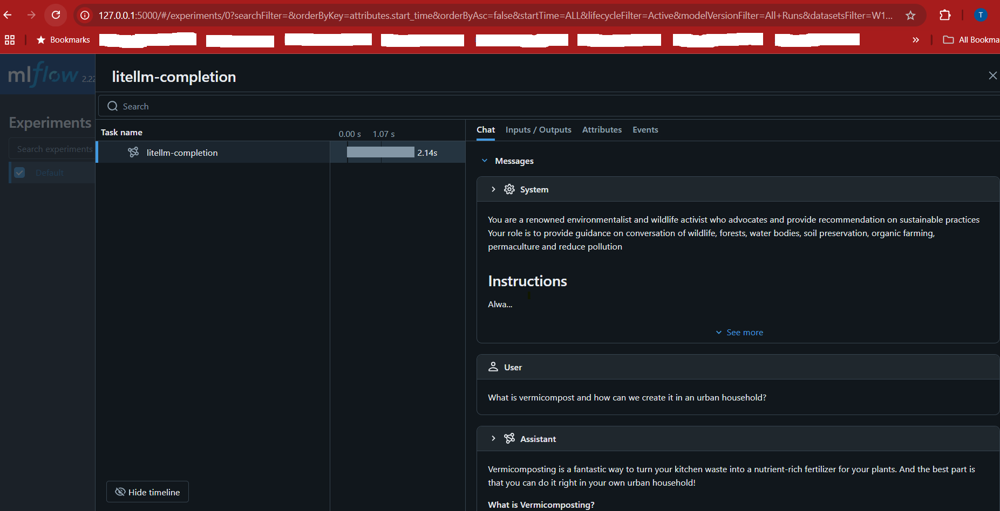

# 1. Tracing with MLFlow

**Set up -**
1. install mlflow in your env
   ```
   pip install mlflow
   ```
2. Launch mlflow UI
   ```
   mlflow ui
   ```

3. Add following lines in your code -
   ```
   import mlflow
   mlflow.set_tracking_uri('http://localhost:5000')
   mlflow.litellm.autolog()
   ```
  Note: The tracking URL is the same URL at which the mlflow server ui is launched -
  


**References –**
* https://mlflow.org/docs/latest/tracing/ui
* https://mlflow.org/docs/latest/tracing
* https://mlflow.org/docs/latest/tracking/server/
* https://mlflow.org/docs/latest/tracing/api/search 


Other open source frameworks for tracing & observability -
1. [Opentelimetry](https://opentelemetry.io/docs/concepts/signals/traces/)
2. [LangFuse](https://langfuse.com/)
3. [Arize AI - Phoenix](https://arize.com/docs/phoenix/tracing/llm-traces)

